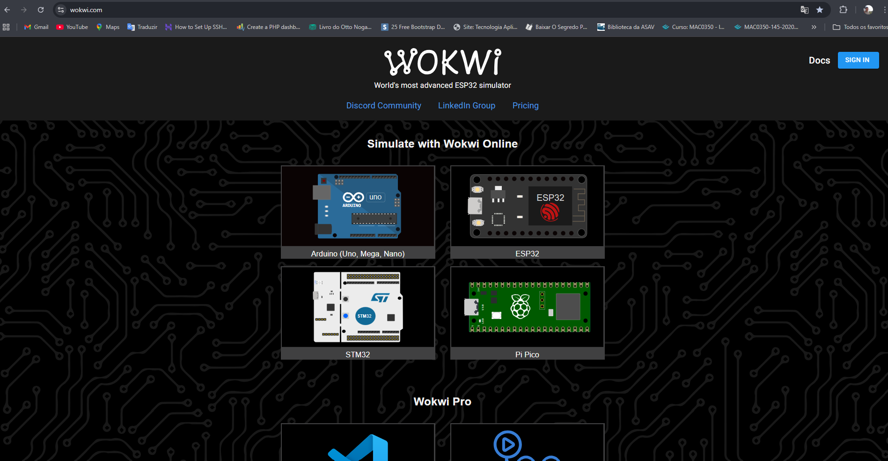

# Plataformas para prototipar online.
***
```
  Para quem está iniciando nesta área, por vezes, pode sentir dificuldades com relação aos custo de adquirir
as placas, sesnsores e atuadores. Para amenizar e tornar o acesso a esse conhecimento em Sistemas Embarcados(IoT),
existe platoformas web onde é possível criar e prototipar projetos, testar códigos e validar algumas implementações
antes de investir em placas físicas.
  Assim, fica bem mais fácil para começar as pesquisas. Aqui vamos apresentar a plataforma: wokwi.com - com ela,
poderá criar muitos projetos interessantes.
  A figura 1.0 mostra a tela inicial ao antrar no site do wokwi.com.
```


Fonte e créditos: url: https://wokwi.com - acessado em 19/setembro/25.

***
   Para fazer uso desta ferramenta, é preciso realizar um cadastro que até o momento em que escrevo este tópico,
  é realizado de forma gratuita e começar a usufruir do ambiente de desenvolvimento para desenvolver seus estudos.
  Lembrando que, ao construir seus projetos em conta gratuita, ficará disponibilidade para que outras pessoas
  possam ver e usar como base que outras criações. Então, podemos usar também como portifólio de nossas
  aplicações.

  Para acessar a plataforma segue o link oficial obtido no site do criador:
  [https://wokwi.com](https://wokwi.com)
  
***
